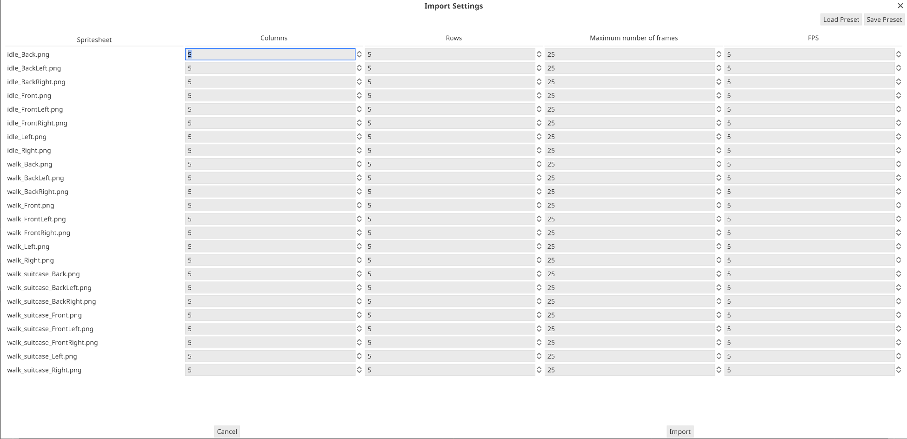
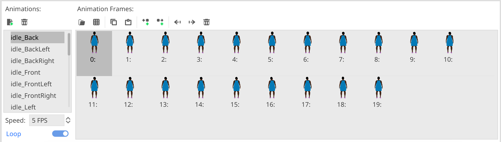

# Sheetstoframes - Turn Spritesheets into Godot SpriteFrames

## Introduction

This Addon for the [Godot game engine](https://godotengine.org) automates the process of turning a number of spritesheet files into the Godot SpriteFrames resource which can be used by animated sprites.

It is used to automate the workflow of managing animations in the game [Safehouse](https://github.com/deep-entertainment/safehouse-game)

## Usage

Start the importer from the tools menu and select any number of Spritesheet files. The following settings window allows you to set the number of columns and rows in the spritesheet.

If the last row of the sheet contains fewer images than the number of columns, you can lower the maximum number of frames, that will be imported.

To help recreating spriteframes from multiple spritesheets, you can store the settings into presets and load them when you need to recreate the spriteframes the next time.

Afterwards, select the SpriteFrames resource file and the addon will convert all spritesheets into animations in the SpriteFrames:

